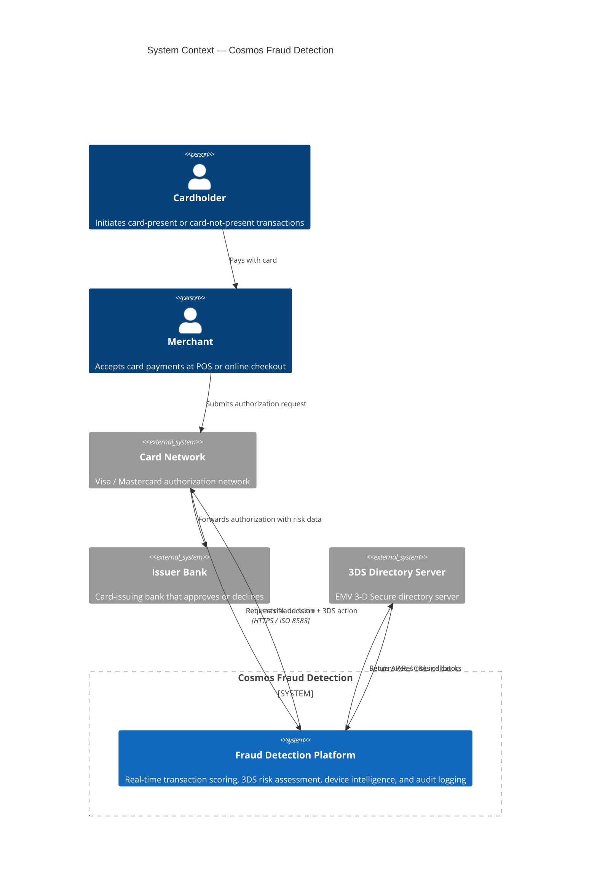
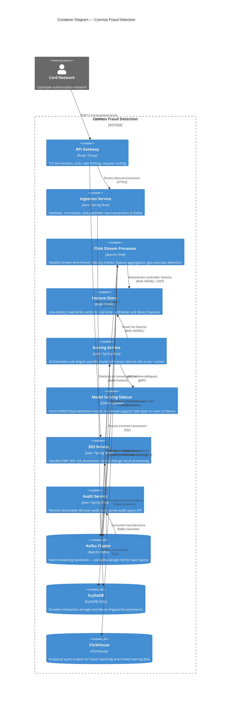
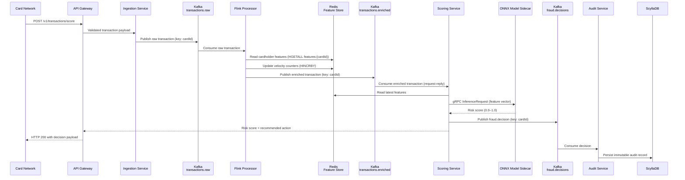

# System Architecture

## Overview

Cosmos Fraud Detection is a real-time transaction scoring platform designed to assess fraud risk during card authorization flows. The system processes transactions inline with the authorization path, targeting sub-50ms end-to-end latency for synchronous decisions, while supporting asynchronous enrichment and analytics workloads in parallel.

---

## C4 Context Diagram



---

## C4 Container Diagram



---

## Primary Data Flow



---

## Side Paths

### Feature Store Read/Write

```
Flink Processor ──HGETALL──► Redis features:{cardId}
                ◄──HSET/HINCRBY──
Scoring Service ──HGETALL──► Redis features:{cardId}
```

### Analytics Pipeline

```
Flink Processor ──► Kafka (transactions.enriched)
                         │
                         └──► ClickHouse Kafka Engine
                                    │
                                    └──► transactions_analytics (MergeTree)
```

### ScyllaDB Persistence

```
Flink Processor ──► ScyllaDB transactions table (partition: card_id)
Audit Service   ──► ScyllaDB audit_records table (partition: transaction_id)
```

---

## Component Responsibilities

| Component | Responsibility | SLA Target |
|---|---|---|
| API Gateway | AuthN/Z, rate limiting, TLS | <5ms overhead |
| Ingestion Service | Schema validation, normalization | <5ms p99 |
| Flink Processor | Feature aggregation, enrichment | <15ms p99 |
| Feature Store (Redis) | Sub-millisecond feature lookup | <1ms p99 |
| Scoring Service | Rule evaluation + ML inference coordination | <25ms p99 |
| ONNX Model Sidecar | Feature vector → risk score | <10ms p99 |
| 3DS Service | 3DS risk assessment, challenge handling | <30ms p99 |
| Audit Service | Immutable decision persistence | async, <500ms |
| ScyllaDB | Durable transaction + device storage | <5ms read p99 |
| ClickHouse | Analytical queries, model training export | batch / interactive |
